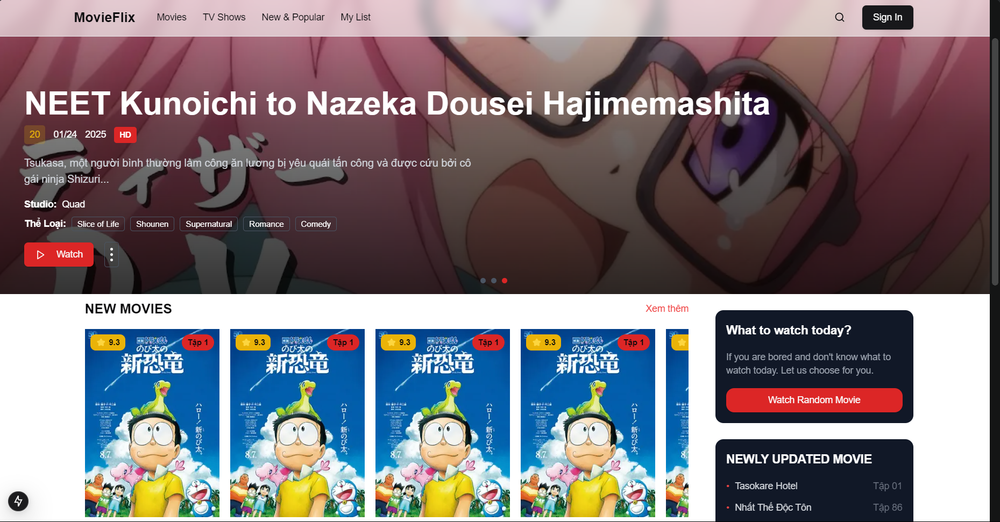

# 🎬 MovieStream Platform

A modern movie streaming platform built with microservices architecture and cutting-edge technologies.

## 🌟 Features

- User authentication and profile management
- Movie streaming with adaptive quality
- Smart movie recommendations
- Advanced search capabilities
- VIP subscription management
- Real-time updates

## 🛠 Tech Stack

### Frontend
- **Framework**: Next.js 14 (App Router)
- **State Management**: 
  - Zustand (Global State)
  - RTK Query (API State)
- **UI Components**: 
  - shadcn/ui
  - Tailwind CSS
  - PostCSS
  - AOS (Animate On Scroll)
- **Icons**: Lucide React
- **Utils**: Date-fns, Lodash

### Backend
- **.NET 8.0 Microservices**
- **Databases**: SQL Server, Redis, MongoDB, Neo4j Sandbox, ClickHouse
- **Message Broker**: RabbitMQ
- **API Gateway**: Ocelot
- **Communication**: HTTP/1

## 📂 Project Structure

```
moviestream/
├── fe/                    # Next.js frontend application
│   ├── public/            # Public files (images, video,...)
│   ├── app/               # App router pages
│       ├── app/           # App router pages
│       ├── components/    # Reusable components
│       ├── hooks/         # Custom hook
│       ├── lib/           # Utils library
│       ├── redux/         # RTK Query services
│       ├── store/         # Zustand stores
│       ├── services/      # Custom services
│       ├── styles/        # Global styles
│       └── type/          # Type management
│   ├── .env/              # Main environment file
│   └── ...
│
├── BE/                    # .NET microservices
│   ├── Services/          # Individual services
│   ├── ApiGateway/        # Ocelot gateway
│   ├── SharedLibrary/     # Shared libraries
│   └── ...
│
└── docs/                  # Documentation
```

## 🚀 Quick Start

1. Clone the repository:
```bash
git clone https://github.com/codersaiya/moviestream.git
cd moviestream
```

2. Start backend services (see backend/README.md)

3. Start frontend development server:
```bash
cd frontend
npm install
npm run dev
```

4. Open [http://localhost:5173](http://localhost:5173)

## 📱 Screenshots



## 🤝 Contributing

1. Fork the repository
2. Create your feature branch (`git checkout -b feature/AmazingFeature`)
3. Commit changes (`git commit -m 'Add AmazingFeature'`)
4. Push to branch (`git push origin feature/AmazingFeature`)
5. Open a Pull Request

## 📄 License

Distributed under the MIT License. See `LICENSE` for more information.

## 📞 Contact

CoderSaiya (Ngô Nhật Cường) - sonysam.contacts@gmail.com

Project Link: [https://github.com/codersaiya/MovieStream](https://github.com/codersaiya/MovieStream)
